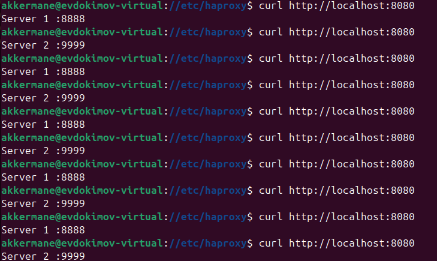
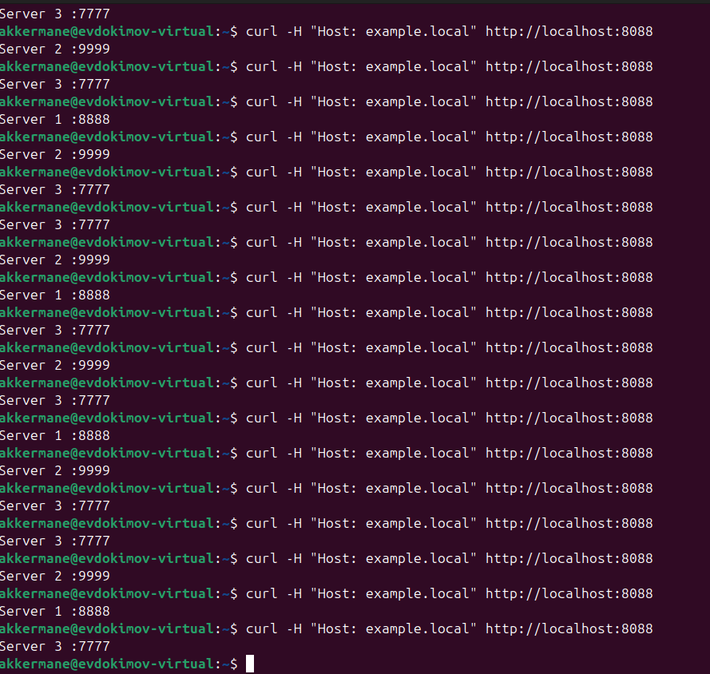
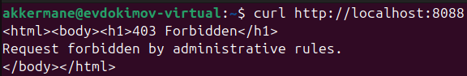

# Кластеризация и балансировка нагрузки Евдокимов Евгений Игоревич  

### Задание 

## Задание 1
Запустите два simple python сервера на своей виртуальной машине на разных портах
Установите и настройте HAProxy, воспользуйтесь материалами к лекции по ссылке
Настройте балансировку Round-robin на 4 уровне.
На проверку направьте конфигурационный файл haproxy, скриншоты, где видно перенаправление запросов на разные серверы при обращении к HAProxy.

## Задание 2
Запустите три simple python сервера на своей виртуальной машине на разных портах
Настройте балансировку Weighted Round Robin на 7 уровне, чтобы первый сервер имел вес 2, второй - 3, а третий - 4
HAproxy должен балансировать только тот http-трафик, который адресован домену example.local
На проверку направьте конфигурационный файл haproxy, скриншоты, где видно перенаправление запросов на разные серверы при обращении к HAProxy c использованием домена example.local и без него.

### Решение

Задание 1





### Задание 2

haproxy.cfg для задания

```
global
    log /dev/log local0
    log /dev/log local1 notice
    daemon

defaults
    log global
    mode http
    option httplog
    option dontlognull
    timeout connect 5000
    timeout client 50000
    timeout server 50000

listen stats
    bind :888
    stats enable
    stats uri /stats
    stats refresh 5s
    stats realm Haproxy\ Statistics

frontend http_front
    bind *:8088

    acl host_example hdr(host) -i example.local
    use_backend weighted_example if host_example
    default_backend reject_backend

backend weighted_example
    balance roundrobin
    server s1 127.0.0.1:8888 weight 2 check
    server s2 127.0.0.1:9999 weight 3 check
    server s3 127.0.0.1:7777 weight 4 check

backend reject_backend
    http-request deny deny_status 403

```
Скриншот c использованием домена example.local



И скриншот без использования домена



